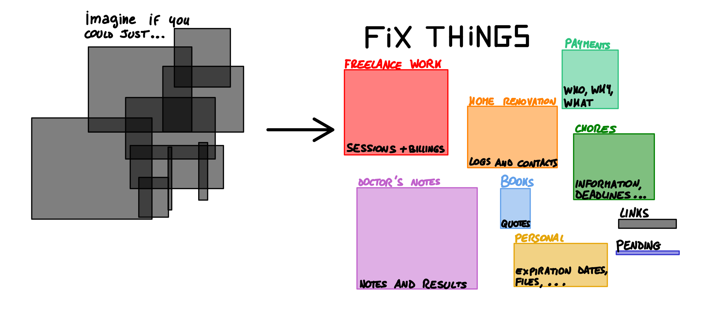

# Attimo

**Attimo** is a personal productivity app designed to store all your lists and records of activities in a single, easy-to-access place. It helps you track, manage, and connect various aspects of your daily life, providing insights into your habits and time management.

## Project mission

In our daily life we are bombarded with information: places to go, things to do, food you enjoyed, which movie to watch next... it can get really overwhelming to keep track of everything. Attimo acts as an extension of your memory, allowing you to record and organize information easily. 

Whether it's keeping track of tasks or storing bits of information, Attimo provides you with the tools to define a list, a _schema_ and quickly add new information with this structure. With everything stored in one place, you’ll have a better understanding of your habits, helping you optimize your time and actions.

### Key Features
- Custom Lists & Schemas: Create structured lists to suit your needs—whether it’s for tasks, notes, or records.
- Habit Tracking: Use Attimo to visualize patterns and behaviors in your daily activities.
- Simple & Lightweight: Built to be intuitive and accessible, Attimo avoids unnecessary complexity.

### Coming soon

- [ ] GUI :: Wails with JS as a layer on top of GO
- [ ] Calendar :: jumping back and forth from table and calendar view.
- [ ] Import :: import various formats data straight into the app (smartwatch, school calendar schedule, ...) 

## About:
**Is this just a table editor?**
Not really. Attimo primarily provides support to check the information that you insert, and ways to navigate the tables, but it makes no effort to support advanced mathematical applications.

**How did the project start?**
The project was born as the replacement for [Tommaso Ferracina](https://github.com/tferracina/)'s [clockwork-cli](https://github.com/tferracina/clockwork) and [Tebe Nigrelli](https://github.com/tebe-nigrelli)'s [doom-emacs](https://github.com/doomemacs/doomemacs) personal config. 

Studying Mathematics for AI inspired us to experiment with [Quantified Self](https://quantifiedself.com/), which ultimately inspired us to start the project.

### Active developers
Attimo is actively developed by [Tommaso Ferracina](https://github.com/tferracina/) and [Tebe Nigrelli](https://github.com/tebe-nigrelli).
